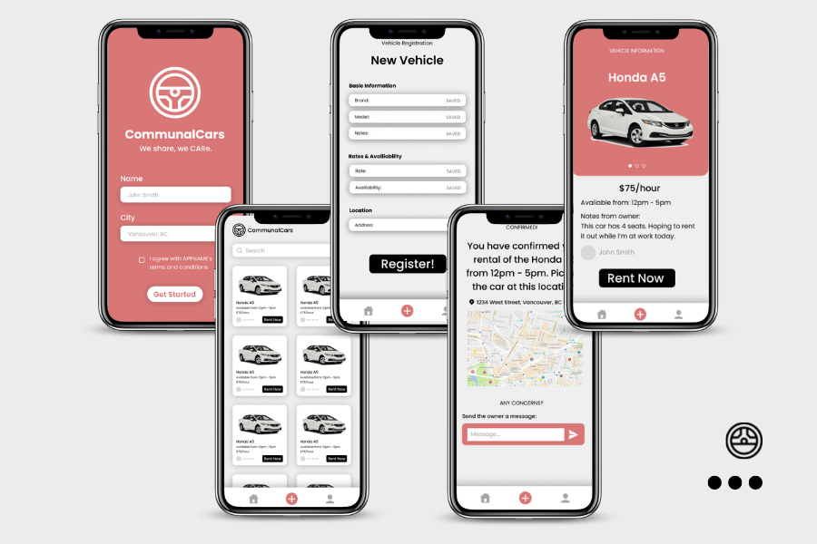

# Communal Cars

A mobile application where users can rent out their own cars or others' cars for a certain period of time, built using React Native, Redux, Node.js (Express), MongoDB and Mongoose. This was built for the Hack the 6ix 2022 hackathon and was awarded as a Top 8 finalist and the Most Creative Use of Twilio prize.

## Viewing The App
To run, clone the repository and do the following on your terminal:

`cd frontend`

`npm install`

`cd ios`

`pod install`

`cd ..`

`npm start`

Then go into the backend:

`cd backend`

`npm install`

`npm backend`

Then go back into the frontend directory:

For IOS:

`npm run ios`

For Android: 

`npm run android`

<h2>Caution</h2>

- To enable connecting to MongoDB database and use backend APIs through Axios, confidential MONGODB_URI with username and password is needed.

- When calling the APIs from backend server, ip address should be replaced by one's own ip address to succesfully get the response.
